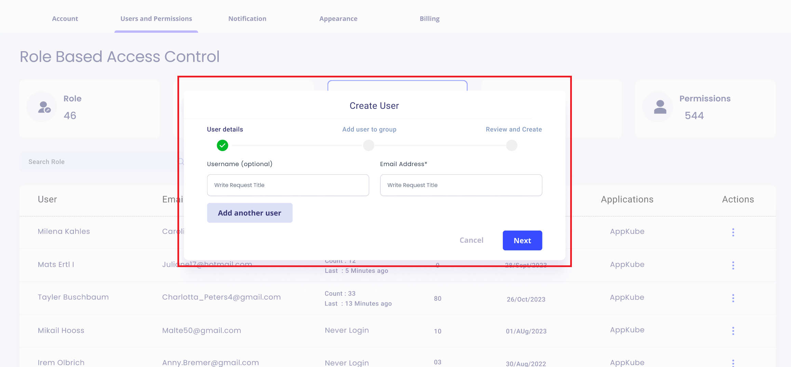
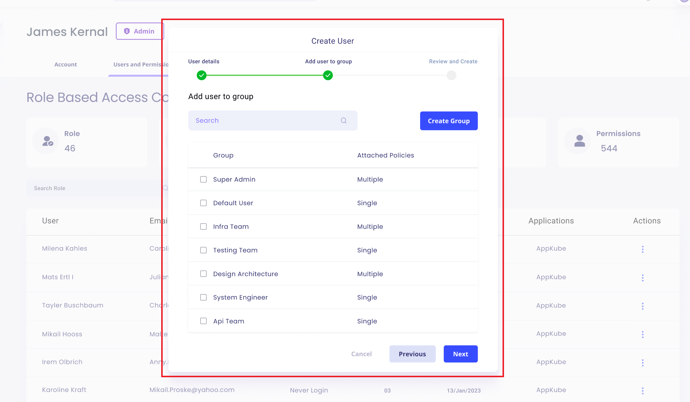
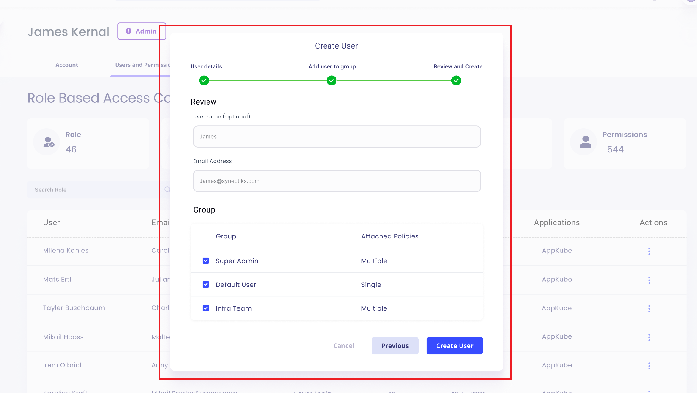
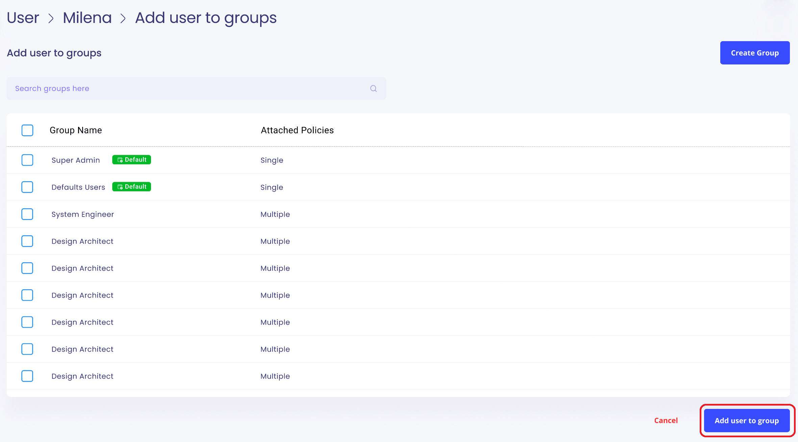

# Use Case: Manage Users

## Actors:
- **Admin:** The system administrator responsible for managing users and access control.

## Triggers:
- Admin logs into the RBAC Module.

## Preconditions:
- The system is operational.
- Admin is authenticated and has access to the RBAC Module.
- The User Screen is loaded.

## Postconditions:
- The user-related information is updated based on the admin's actions.

## Normal Flow:

### 1. View User Screen:
   - Admin logs into the RBAC Module.
   - System displays the User Screen with a search bar for users and a button for creating users.

   

### 2. Create New User:
   - Admin clicks on the "Create User" button.
   - System displays a popup with three stages for adding a user:

   

   # Stage 1: Input fields for username, email address, and an option to add a second user.
   
   

   # Stage 2: Add user to a particular group or create new groups.

   

   # Stage 3: Review details and create the user in the system.

   

   - If groups are not created, the user is added to a basic user group with minimal policies and limited permissions.
   - User receives an email for system access.

### 3. View User Details:
   - Admin can access details about a particular user by clicking on their name on the User Screen.
   - System redirects to the User Profile page for the selected user.

   

### 4. User Profile Page:
   - User Profile page displays the user's picture, creation date, last activity, and application access rights.
   - Tabs for:
      - First Tab: Shows the number of permissions each user has.
      - Second Tab: Displays user groups and allows admins to remove or add groups.

      

      - Admin clicks on the Add User Group button.

      

      - system displays add user to groups screen.
      -  the admin can select a single or multiple group. If a group has not yet been created, the administrator can click on create a group.

         

       - admin select groups from group table and click on remove button and user detached from the all the group after removing user from the group. 

       The admin selects groups from the group table and clicks on the remove button. The user is then detached from all the groups once the user has been removed from the group. 

         

      - Third Tab: Security credentials, including last password update, last sign-in information, and two-factor authentication status.
   - Admin can use the "Delete User" button to delete users.
      
   - Admin can use the "Reset Password" button to reset user passwords.
   

   
## Alternative Flows:
- If the admin cancels the user creation at any stage, the process is terminated, and the user is not created.
- If the admin does not select or create any groups during user creation, the user is added to a default basic user group.
- If two-factor authentication is enabled during user creation, the system prompts the user accordingly.
- If the admin cancels the deletion of a user, the user remains in the system.
- If the admin cancels the password reset, the user's password remains unchanged.

## Exceptions:
- If there are issues with the email notification system, the user might not receive the system access email.
- If there are issues with group creation, the system notifies the admin and prompts for corrective action.
