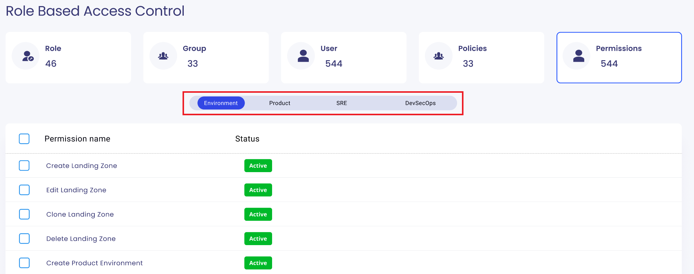

# Use Case: Manage Permissions

## Actors:
- **Admin:** The system administrator responsible for managing permissions and access control.

## Triggers:
- Admin logs into the RBAC Module.

## Preconditions:
- The system is operational.
- Admin is authenticated and has access to the RBAC Module.
- The Permissions Screen is loaded.

## Postconditions:
- The permission-related information is updated based on the admin's actions.

## Normal Flow:

### 1. View Permissions Screen:
   - Admin logs into the RBAC Module.
   - System displays the Permissions Screen with four permission sets: Environment, Product, SRE, and DevSecOps.

    

### 2. View Existing Permissions:
   - Admin can view the existing permission sets and other permissions created by the system or backend team.
   - Admin cannot create new permissions or permission sets; these are managed by the system.

### 3. Search Permissions:
   - Admin uses the search functionality to find specific permissions or permission sets.

## Alternative Flows:
- If the search yields no results, the system informs the admin and suggests refining the search criteria.

## Exceptions:
- Admin cannot create new permissions or permission sets; these are created by the system or backend team.

This use case outlines the limited functionality of the Admin in managing permissions. The Admin can view and search existing permissions and permission sets but cannot create new ones, as this functionality is reserved for the system or backend team in the RBAC Module.
