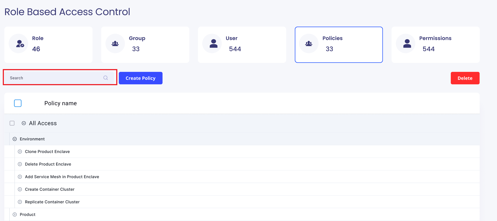

# Use Case: Manage Policies

## Actors:
- **Admin:** The system administrator responsible for managing policies and access control.

## Triggers:
- Admin logs into the RBAC Module.

## Preconditions:
- The system is operational.
- Admin is authenticated and has access to the RBAC Module.
- The Policy Screen is loaded.

## Postconditions:
- The policy-related information is updated based on the admin's actions.

## Normal Flow:

### 1. View Policy Screen:
   - Admin logs into the RBAC Module.
   - System displays the Policy Screen with a search bar for policies and a button for creating policies.

   

### 2. Create New Policy:
   - Admin clicks on the "Create Policy" button.
   - System displays a Create Policy page with:
      - Policy Name input field.
      - Policy Description input field.
      - Search bar for permissions.
   - Admin selects a permission and clicks "Create Policy."
   - If canceled, the admin is redirected to the Policy Screen.
   

### 3. View Default Policies:
   - System displays two default policies: "All Access" for administrators and "Minimal Access" for basic users.
   - These default policies cannot be deleted and are attached to the default group in the Group Screen.

## Alternative Flows:
- If the admin provides incomplete information while creating a policy, the system prompts for required details.
- If the admin cancels the policy creation, the system redirects the admin to the Policy Screen without creating a new policy.
- If the admin attempts to delete default policies, the system displays an error message.
- If the search yields no results, the system informs the admin and suggests refining the search criteria.

## Exceptions:
- If there are issues with the permission search functionality, the system notifies the admin and suggests trying again.
- If there are issues with the database during policy creation, the system notifies the admin of the failure.

This use case outlines the step-by-step process for managing policies, including policy creation, viewing default policies, and handling alternative flows and exceptions in the RBAC Module.
