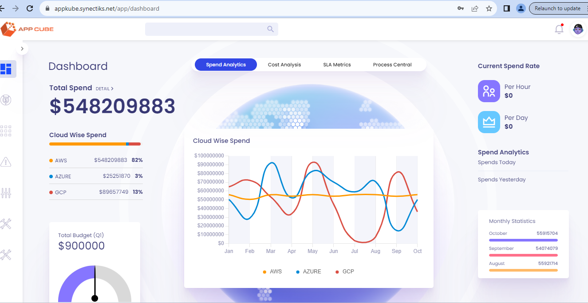
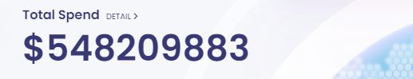
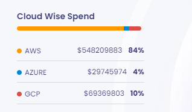
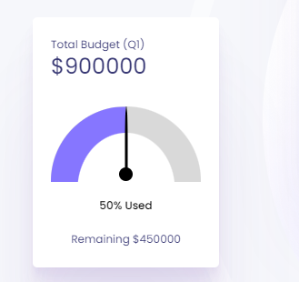
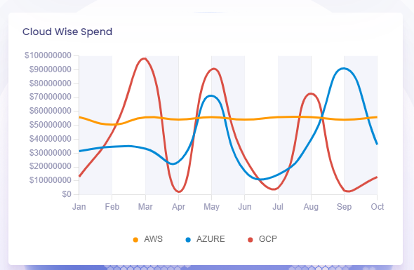
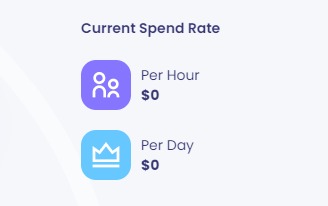
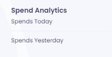
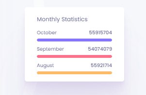

**Product Landing Page**

**landing page**

**CMDB API End Point**: <http://34.199.12.114:6057/api>

The landing page show Spend Analytics tab and this tab many statistics
comes from various CMDB APIs.

1.  Total Spend

Api - GET:
/query/organization/:orgId/analytics/spend-analytics/spend-total

2.  Cloud wise spend

Api -- GET:
query/organization/:orgId/analytics/spend-analytics/cloud-wise-spend

3.  Total Budget

Api -- GET:
query/organization/:orgId/analytics/spend-analytics/total-budget

4.  Cloud wise spend

Api -- GET:
query/organization/:orgId/analytics/spend-analytics/monthly-cloud-wise-spend

5.  Current spend rate

Api -- GET:
query/organization/:orgId/analytics/spend-analytics/spend-current-rate/avg-per-hour

GET:
query/organization/:orgId/analytics/spend-analytics/spend-current-rate/per-day

6.  Spend Analytics

Api -- GET:
query/organization/:orgId/analytics/spend-analytics/spend-today

GET: query/organization/:orgId/analytics/spend-analytics/spend-yesterday

7.  Monthly Statistics

> 
>
> Api -- GET:
> query/organization/:orgId/analytics/spend-analytics/monthly-statistics
