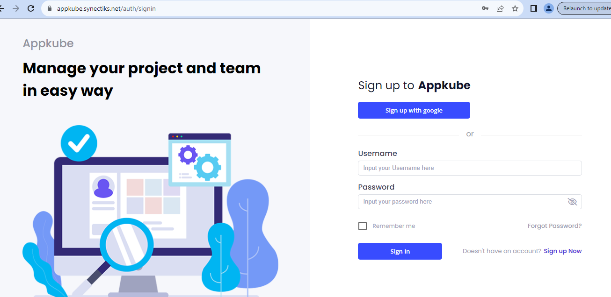
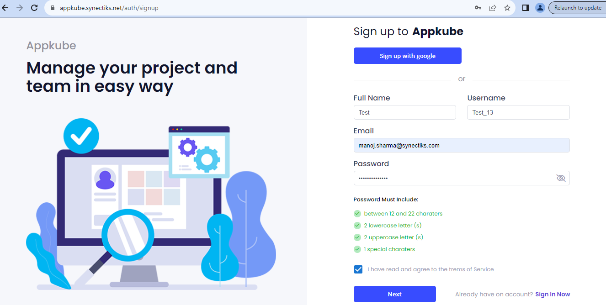
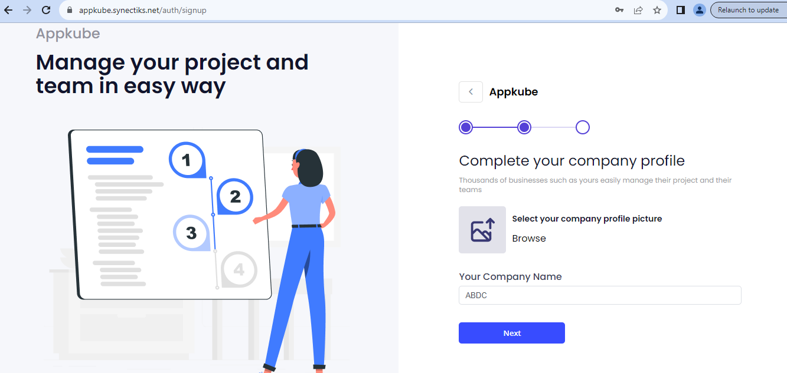
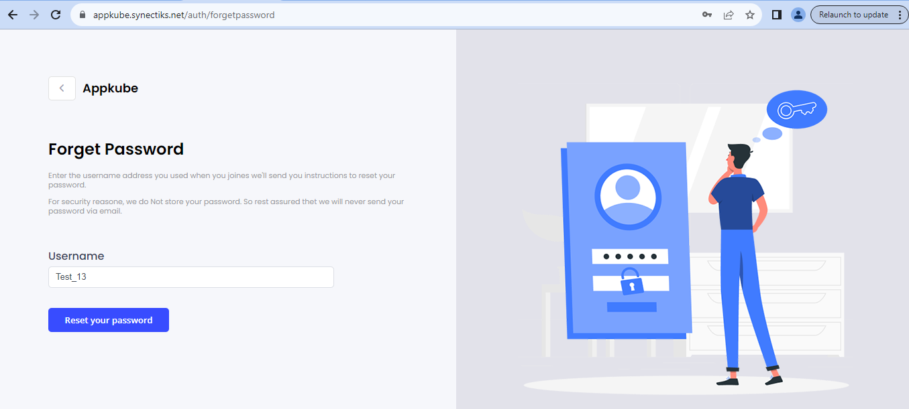
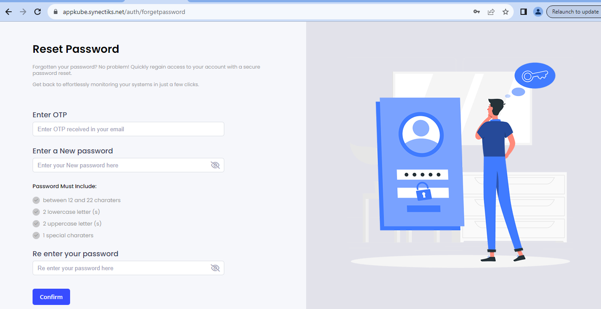

**Security Service API End Point:** <http://34.199.12.114:8094/security>

**CMDB API End Point**: <http://34.199.12.114:6057/api>

**Login**

API:

GET:
http://34.199.12.114:8094/security/public/login?username=home_test&password=home_test

**Create User**

API call

POST: <http://34.199.12.114:8094/security/users/create>

**Forgot Password.** It is a two step process.

1.  First user has to provide, his/her user name to get the OTP to the
    registered email-id.

API call

POST:
<http://34.199.12.114:8094/security/users/forgot-password?userName=Test_13>

This API send a mail to the registered mail-id of the given username.

This mail contains a six-character OTP. On the next screen user must
provide this OTP to reset the password

2.  Provide OTP received in the mail along with the new password.

API Call.

POST: http://34.199.12.114:8094/security/users/reset-password
