# Use Case: Adding a Product

## Use Case Description

This use case outlines the process for a user to add a product to a created department within the microservices monitoring tool.

## Trigger

The trigger for this use case is the need to add a new product to an existing department within the organization.

## Primary Actors

- User: Responsible for initiating the process and providing necessary information for adding a product to a department.

## Precondition

The user must be authenticated and have appropriate permissions to add a product to the selected department.

## Postcondition

The new product is successfully added to the selected department with all relevant configurations and services.

## Main Flow

1. The user logs into the microservices monitoring tool and navigates to the dashboard.
2. The user selects the previously created department from the list of available options.
3. The system displays the options for the selected department, including the ability to add a new product.
4. The user clicks on the option to add a product, triggering the product addition process.
5. The system presents a screen with a field to input the name of the product and options to choose the deployment environment (Development, Test, Stage, Production).

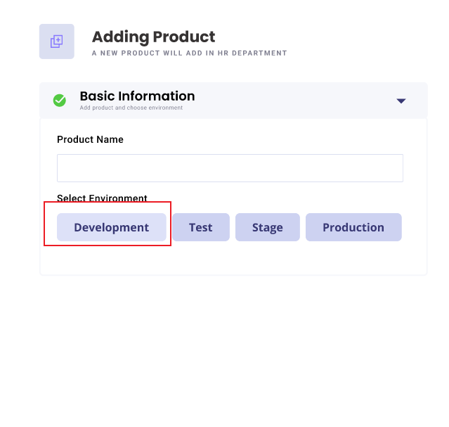

6. After selecting the deployment environment, the system presents options for the product category: 3 Tier and SOA.
7. If the user selects the SOA option, the system displays a field to set the module name.

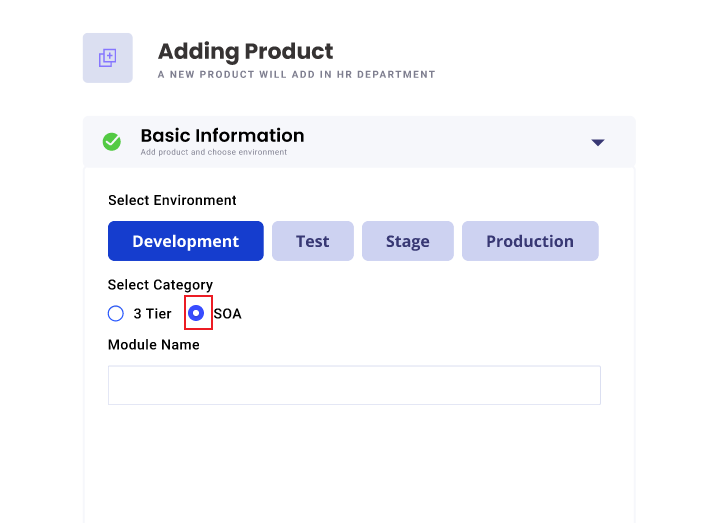

8. The user fills in the required information and clicks on the "Next" button to proceed.

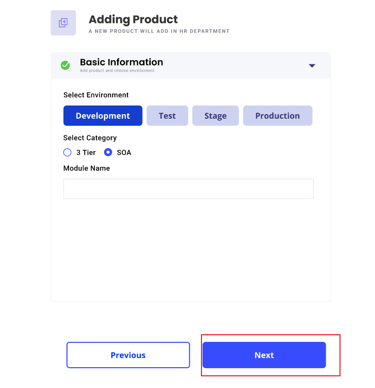

9. The system presents a screen with options to add services for the product: Business Service and Common Service.
10. The user clicks on the "Add" button for the Business Service.

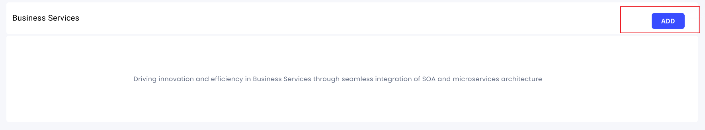

11. The system displays a screen to set the module, showing options to select the App Service from the given options.

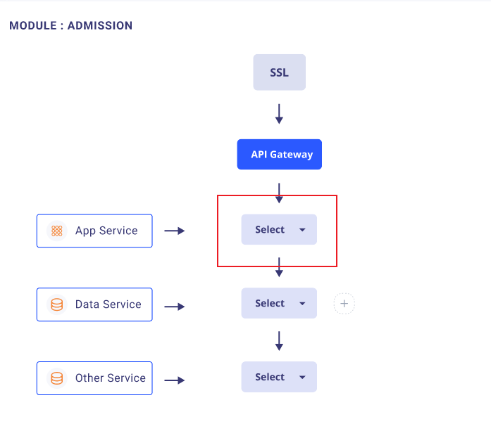

12. The user selects a specific App Service and clicks on the "Next" button.
13. The system prompts the user to select the "Deployed to Service" and displays instances of the selected service.

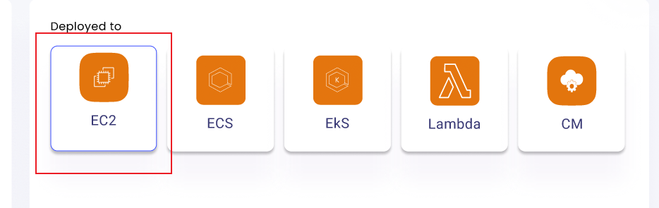

14. The user selects the desired instance, and the system shows the details of that instance, including service name, port details, and department.

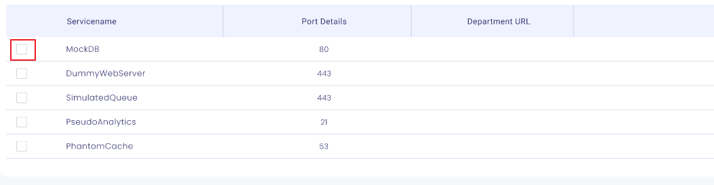
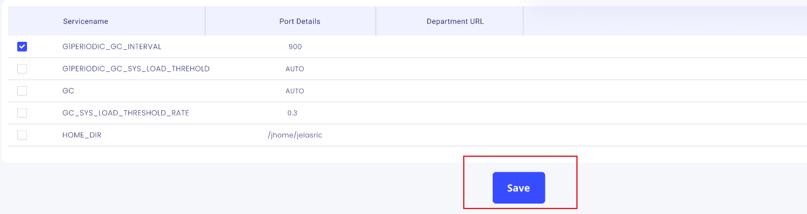

15. The "Save" button is activated, and the user clicks on it to save the configuration.
16. The procedure repeats for the Data Service, and then for Other Services.
17. Once all services are added, the system confirms the successful addition of the product to the department.

18. If the user selects the 3 Tier option, the system prompts the user to set the module name.
19. The user fills in the required information and clicks on the "Next" button to proceed.

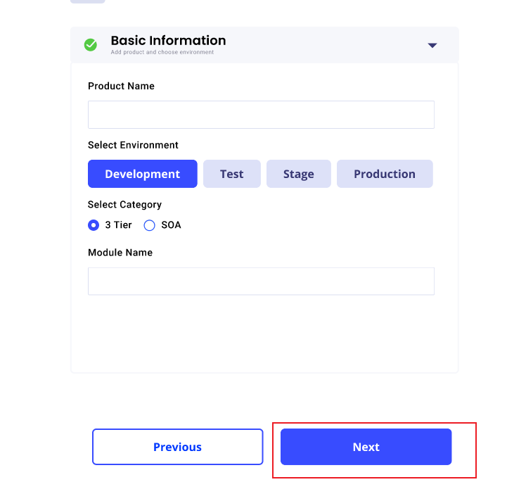

20. The system presents a screen with options for the 3-tier architecture: Web Layer, App Layer, Data Layer, Aux Layer.

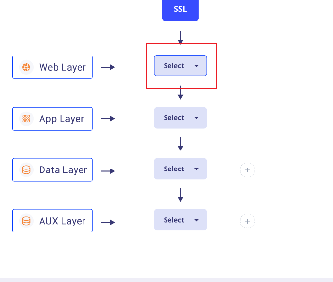

21. The user selects an option for the Web Layer.

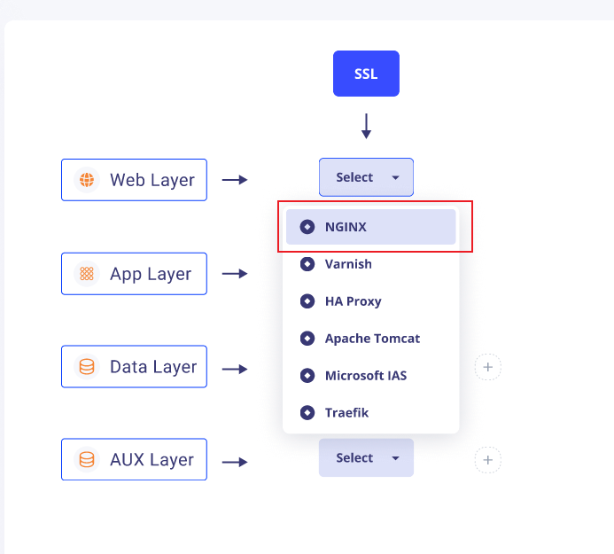

22. The system presents a screen to deploy the product in a service, showing available options.

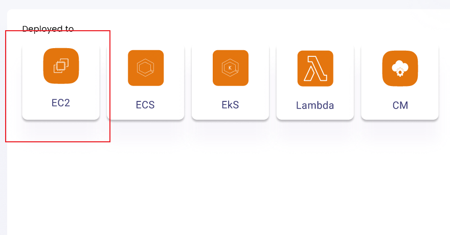
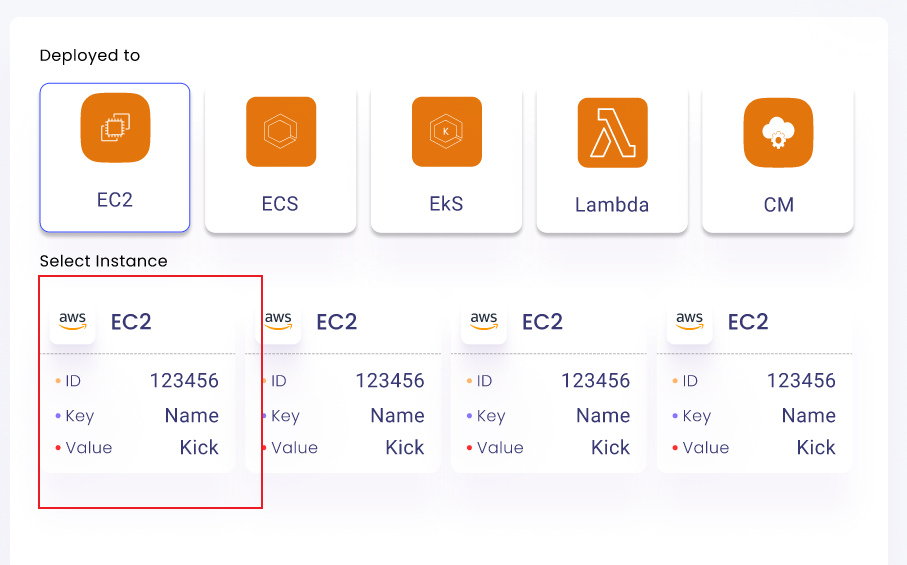

24. The system displays instances of the selected service.
25. The user selects a specific instance, and the system shows the details of that instance, including service name, port details, and department.

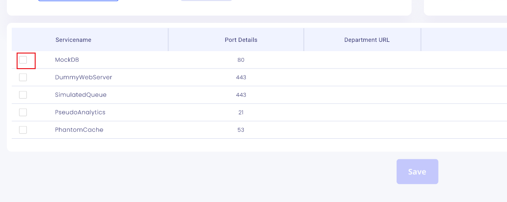

26. The "Save" button is activated, and the user clicks on it to save the configuration.

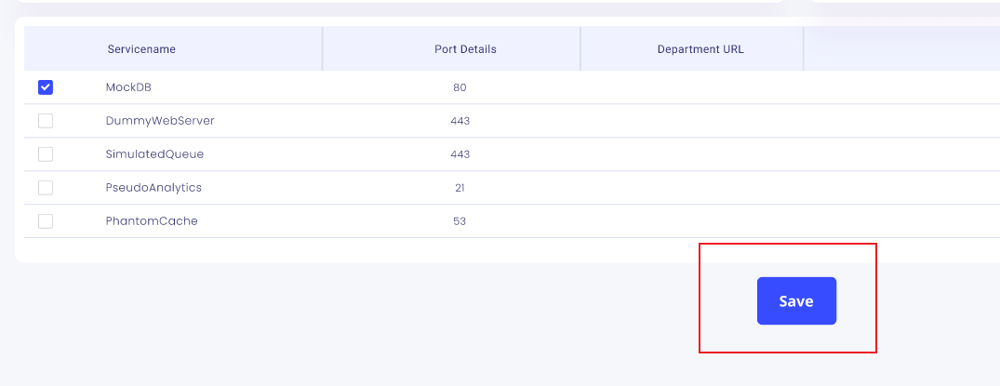

27. The procedure repeats for the App Layer, Data Layer, and Aux Layer.
28. Once all layers are configured, the system confirms the successful addition of the product to the department.

## Alternate Flow

- If at any step the user decides to cancel the process, they can click on the "Cancel" button to abort the product addition process.
- If there are errors or missing information during any step, the system prompts the user to correct the issues before proceeding.
