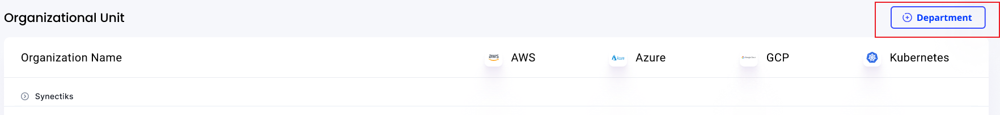
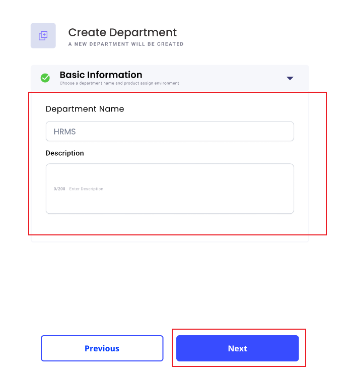
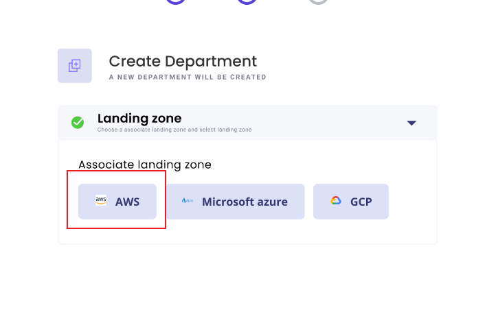
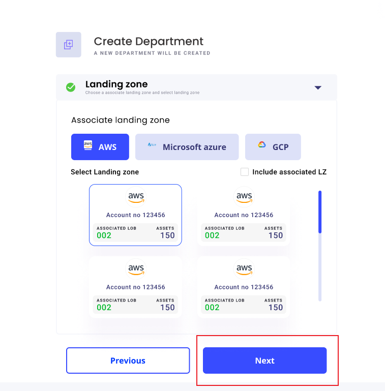
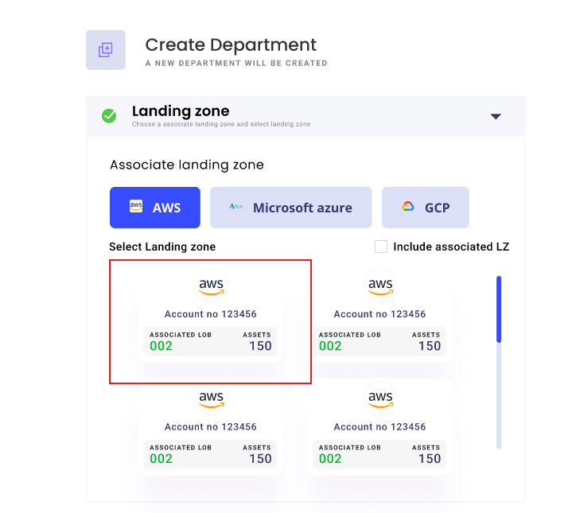
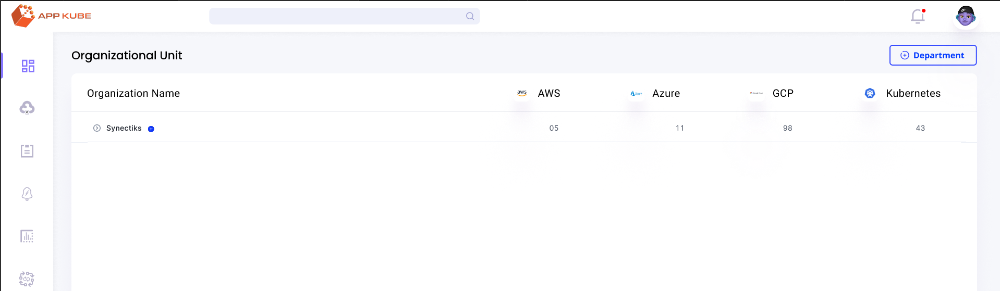

# Use Case: Creating Department

## Use Case Description

This use case describes the process for creating a new department within the microservices monitoring tool.

## Trigger

The trigger for this use case is the need to establish a new department within the organization.

## Primary Actors

- Admin: Responsible for initiating and overseeing the department creation process.
- User: Provides necessary information and selects options during the department creation process.

## Precondition

The user must be authenticated and have the necessary permissions to create a department within the microservices monitoring tool.

## Postcondition

A new department is successfully created and visible within the organization's structure in the microservices monitoring tool.

## Normal Flow

1. The admin logs into the microservices monitoring tool and navigates to the dashboard.
2. The admin selects the option to create a new department.
3. The system displays the dashboard showing the organization's structure, including available organization units and web services (AWS, Azure, GCP, Kubernetes), along with a button to proceed with department creation.
4. The administrator clicks on the "Department" button, initiating the department creation process.

5. The system presents a screen for entering basic department information, including the department name and description.
6. The administrator fills in the required information and clicks on the "Next" button.

7. The system presents a screen for selecting the landing zone to deploy the department.

8. The administrator selects a specific landing zone and clicks on the "Next" button.

9. The system fetches the accounts associated with the chosen landing zone and presents them to the administrator.

10. The administrator can include associated LZ accounts and select the desired account(s) for the department.
11. The administrator clicks on the "Next" button to proceed.

12. The system confirms the selected account and presents a summary of the department creation details.
13. The administrator verifies the information and clicks on the "Next" button to finalize the department creation process.
14. The system creates the department, assigns the selected account(s), and displays a success message.

## Alternate Flow

- If at any step the administrator decides to go back, they can click on the "Previous" button to navigate to the previous screen and make changes as needed.
- If there are errors or missing information during any step, the system prompts the administrator to correct the issues before proceeding.
