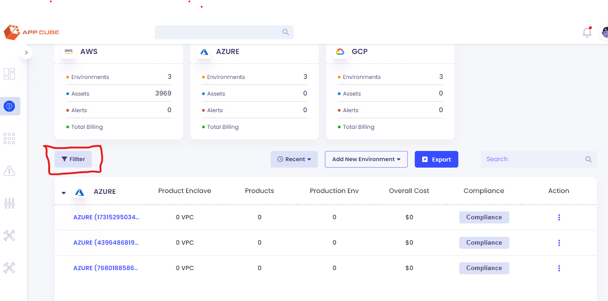
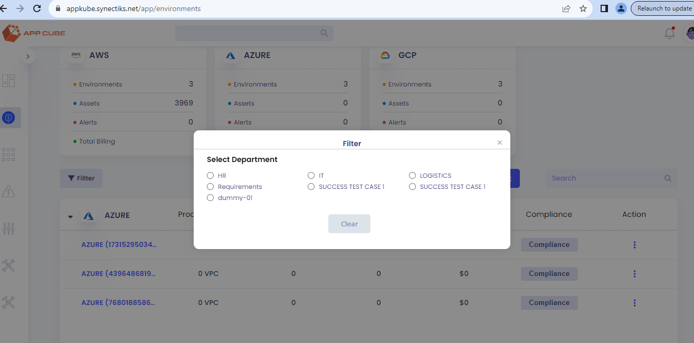
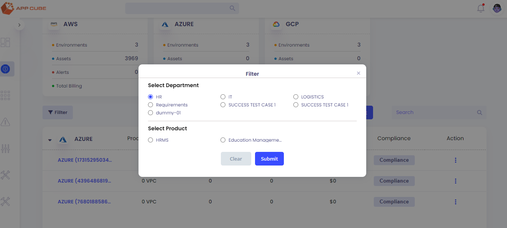
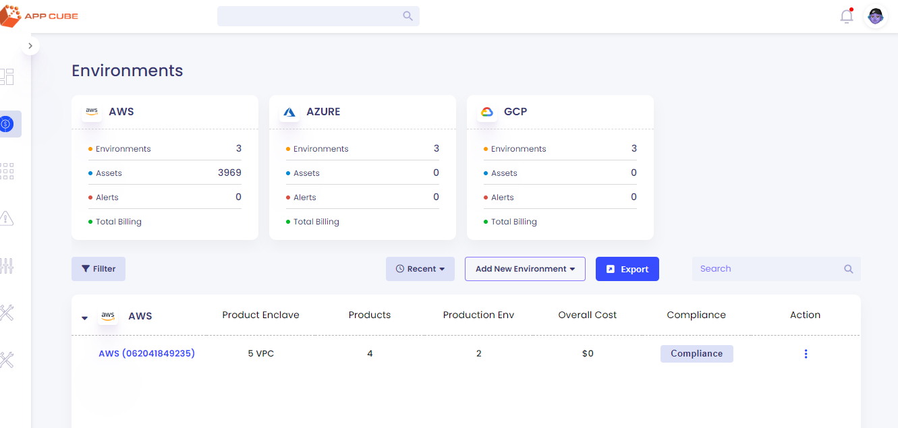
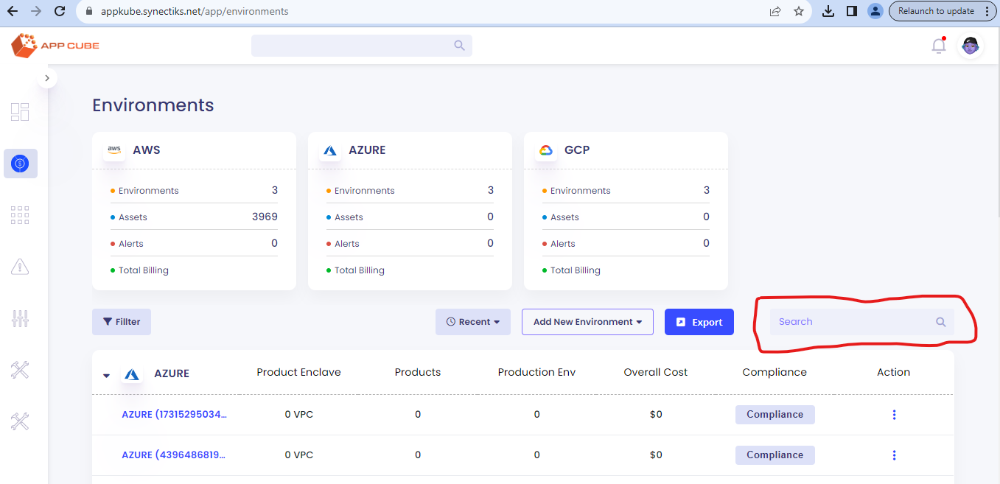

**CMDB API End Point**: <http://34.199.12.114:6057/api>

1.  Click on filters on environment page

2.  Click on filter button opens a Pop-up showing all the departments of
    the given organization

> 
>
> Api Call: **Get : /organization/:orgId**

**\
**

3.  Click on any department radio button, gets the list of all the
    products of the selected department

Api call: **GET - /product/search?departmentId=1**

4.  Click on any product and press submit button, filter the landing
    zones based on the selected department and product.

Api call GET -
**/query/organization/:orgId/environment/summary-list?departmentId=1&productId=1**

5.  Search is managed by react only

