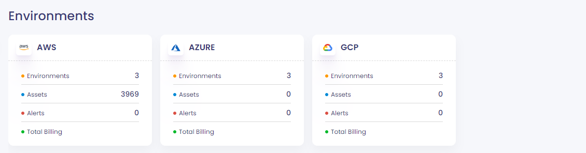
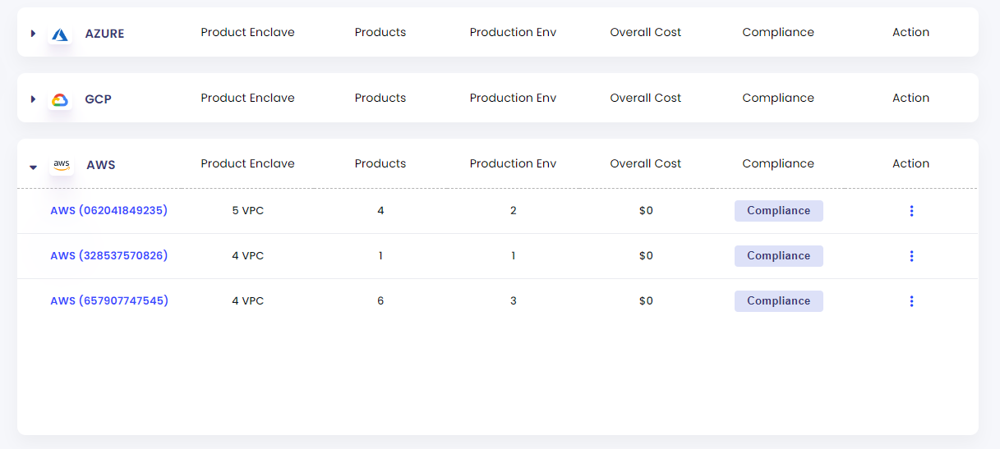
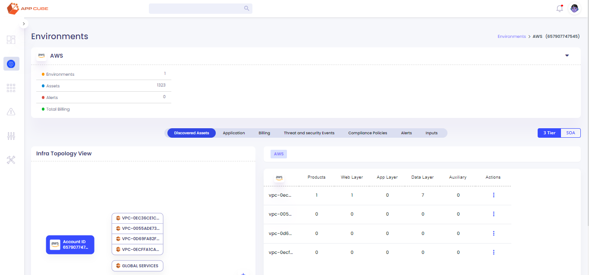
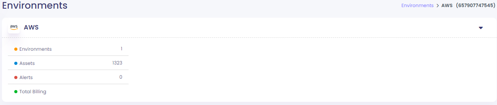
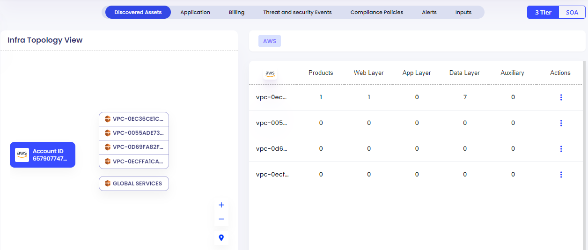
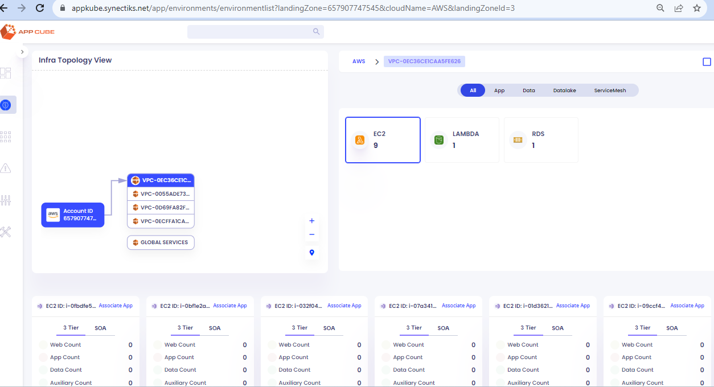
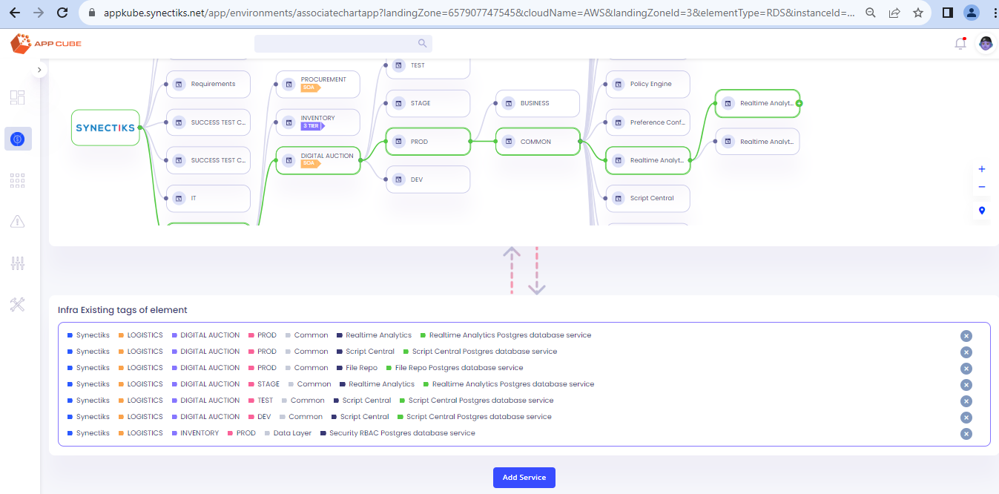

**Use Case: Show Infra Element Explorer AWS**

Environments Page

1.  **Environment summary**

CMDB service stores appconfig details of each landingzone in
cloud_element_summary table

CMDB Apis

1.  Api to create above view

GET: **/query/organization/:orgId/environment/count**

(e.g /query/organization/1/environment/count)

2.  Apis to store landingzone specific appconfig summary in
    cloud_element_summary table

> There are two ways to do it.

2.1 Direct CMDB POST Api to store information in cloud_element_summary
table

POST: **/cloud-element-summary**

2.2 **Discover AWS element - appconfig**.

> GET**: /infra-discovery/organization/:orgId/aws**
>
> Above CMDB Api will call respective awsx-api based on the elementType
> parameter and store information in cloud_element_summary table

Parameters

orgId (required) (e.g. 1)

landingZone (required) (e.g. 657907747545)

> elementType (required) (**APP_CONFIG_SUMMARY**)
>
> This **APP_CONFIG_SUMMARY** static identifier to call awsx-api

awsRegion (optional)

> awsRegion is optional. If not provided system uses default region
> us-east-1

Sudo code:

1.  CMDB **/infra-discovery/organization/:orgId/aws** API call awsx-api

    a.  Based on the element type(**APP_CONFIG_SUMMARY**) It call
        **AppConfigHandler.java.** This handler calls **/appconfig** API
        from awsx-api go micro-service and save the response in
        cloud_element_summary table

    b.  awsx-api: GET:
        [http://localhost:7000/awsx/:elementType](http://localhost:7000/awsx/appconfig)

> Parameters:
>
> vaultUrl: http://34.199.12.114:8200/v1/kv-v1
>
> vaultToken: a29LEjdI1LYKAKr7OpVlXx54y30kBem2QNdqn2FqUJ4=
>
> accountId (its a vault key - e.g. SYNECTIKS/HR/AWS/062041849235)
>
> zone (it is optional AWS region. if not provided, system uses the
> default region us-east-1)

2 . **Environment details**

CMDB API for above view:

GET: /query/organization/:orgId/environment/summary-list

3\. **Environments -- Infra Topology**

The above screen has two parts

3.1 

CMDB API for above view:

GET -
/query/organization/1/environment/cloud/AWS/landing-zone/657907747545/count

3.2

CMDB API for above view:

GET: /query/organization/1/infra-topology/landing-zone-id/:landingzoneId
(e.g. 3)

3.3 Topology view (Product enclave wise)

CMDB API: Two APIs for above view

3.3.1 - GET:
/query/organization/:orgId/infra-topology/landing-zone/:landingZone/product-enclave/:instanceId/cloud-elements

3.3.2 - GET:
/query/organization//:orgId/infra-topology/landing-zone//:landingZone
/product-enclave//:instanceId/category-wise-summary

3.4 Infra to Service Association

CMDB API: Associate cloud-element with business element

POST: /cloud-element/associate

**Discover AWS element**

1.  **VPC**.

> GET**: /infra-discovery/organization/:orgId/aws**
>
> Above CMDB Api will call respective awsx-api based on the elementType
> parameter and store information in product_enclave table

Parameters

orgId (required) (e.g. 1)

landingZone (required) (e.g. 657907747545)

> elementType (required) (**VPC**)
>
> **VPC** is a static identifier to call awsx-api
>
> awsRegion (optional) it is optional. If not provided system uses
> default region us-east-1

Sudo code:

1.  CMDB **/infra-discovery/organization/:orgId/aws** API call awsx-api

    a.  Based on the element type(**VPC**) It call **VpcHandler.java.**
        This handler calls **/vpc** API from awsx-api go micro-service
        and save the response in product_enclave table

    b.  awsx-api: GET:
        [http://localhost:7000/awsx/:elementType](http://localhost:7000/awsx/vpc)

> Parameters:
>
> vaultUrl: http://34.199.12.114:8200/v1/kv-v1
>
> vaultToken: a29LEjdI1LYKAKr7OpVlXx54y30kBem2QNdqn2FqUJ4=
>
> accountId (its a vault key - e.g. SYNECTIKS/HR/AWS/062041849235)
>
> zone (it is optional AWS region. if not provided, system uses the
> default region us-east-1)

2.  **CDN, DynamoDB, EC2, ECS, EKS, Kinesys, Lambda, RDS, S3**

> GET**: /infra-discovery/organization/:orgId/aws**
>
> Above CMDB Api will call respective awsx-api based on the elementType
> parameter and store information in product_enclave table

Parameters

orgId (required) (e.g. 1)

landingZone (required) (e.g. 657907747545)

> elementType (required) (CDN, DynamoDB, EC2, ECS, EKS, Kinesys, Lambda,
> RDS, S3)
>
> awsRegion (optional)
>
> it is optional. If not provided system uses default region us-east-1

Sudo code:

2.  CMDB **/infra-discovery/organization/:orgId/aws** API call awsx-api

    a.  Based on the element type(**VPC**) It call **VpcHandler.java.**
        This handler calls **/vpc** API from awsx-api go micro-service
        and save the response in product_enclave table

    b.  awsx-api: GET: <http://localhost:7000/awsx/:elementType>

> Parameters:
>
> vaultUrl: http://34.199.12.114:8200/v1/kv-v1
>
> vaultToken: a29LEjdI1LYKAKr7OpVlXx54y30kBem2QNdqn2FqUJ4=
>
> accountId (its a vault key - e.g. SYNECTIKS/HR/AWS/062041849235)
>
> zone (it is optional AWS region. if not provided, system uses the
> default region us-east-1)
