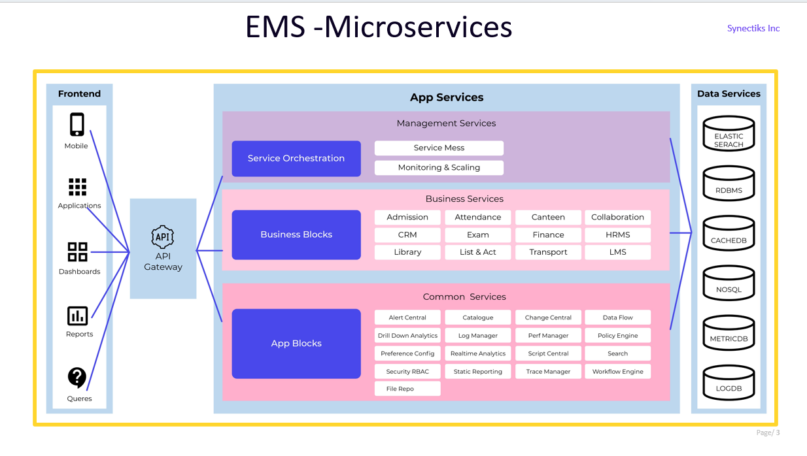
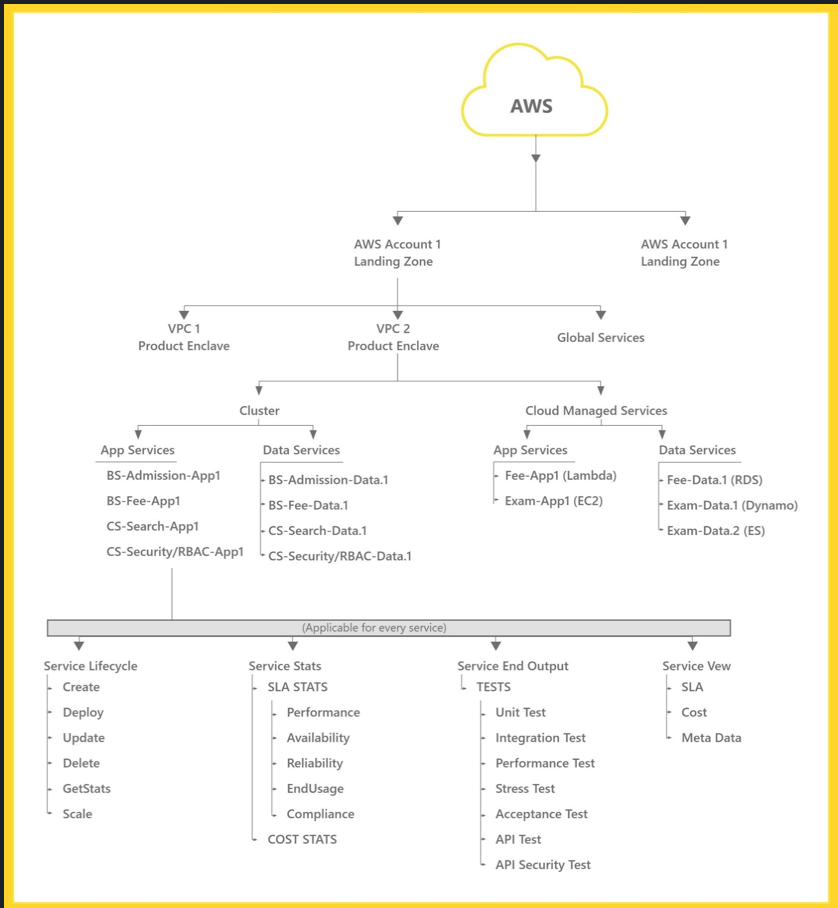
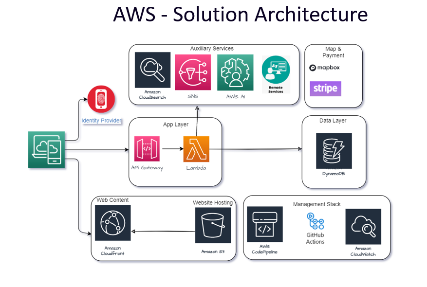
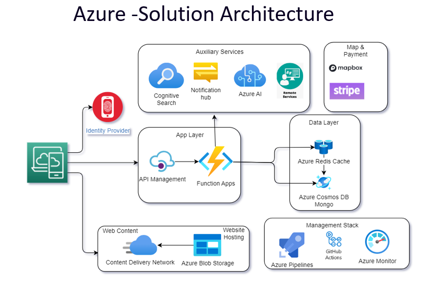
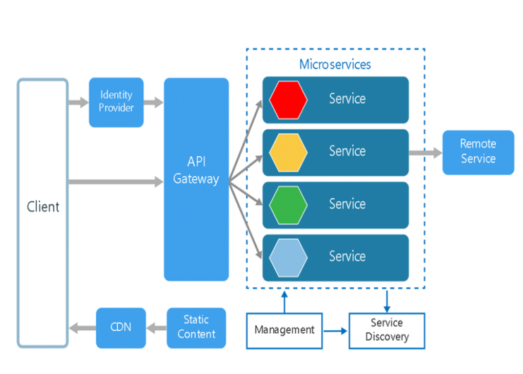
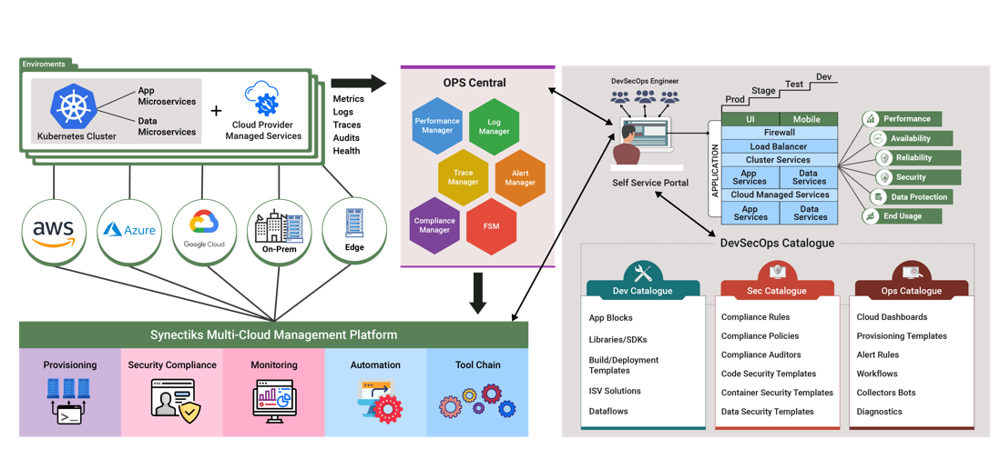
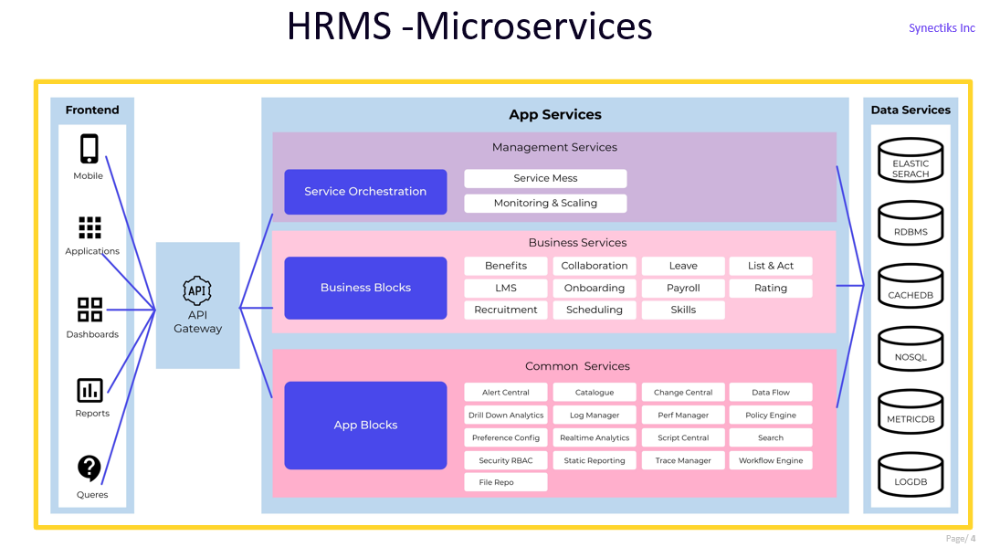
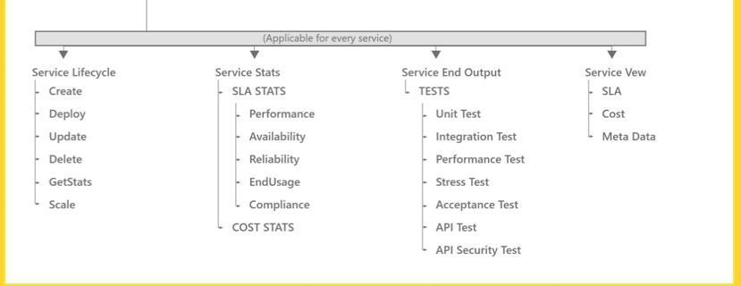

## Organization
We refer the main enterprise that takes Appkube product. Organization name is assigned to the product when its first time deployed.

## Department or LOB or Business Unit

Every enterprises have different department that owns different products specific to their business.

## Cloud --
There are cloud providers like AWS / AZURE / GCP who provides IT infrastructure as service(IAAS). Enterprises are moving their IT infrastructure mostly to the cloud providers(AWS,Azure,GCP).

## Landing Zone --

Whenever you want to go to a cloud provider, you should create a separate account(Root Account) and create a new account for separate business units(deparments) and deploy the products and services for that business unit in that child account. every child account is called the landing zone for the organization.The correct analogy could be , you are creating a airport for your flight services.The child account is created with some security and compliance as like airport standards. For different clouds the landing zone technically looks different , like for AWS is account, Azure is tenant and GCP is project etc. To treat all clouds in same way we call it landing zone.

## Product Enclave --

Inside the landing zone, we create several isolated network zones for different products -
That is called product enclave. Generally you deploy a pariticular product inside the product enclave.The correct analogy could be , you are creating the terminals inside the Airport(Landing Zone)

## Product

Every business units runs different kinds of software products like HR department runs 
HRMS, TOUR product. Generally for every product , a separate product enclave is created where the product related all workloads get deployed and managed.

## Environment

For every enterprise product, generally we keep multiple environments.Software products changes are done through multiple stages of the process to avoid regression. Developers write and build the product in Dev environment, Testers test the product in Test environment,and after testing the product, the feature is deployed to stage environment for final review and finally pushed to production. So every environment will hold the services for the product.The infrastructure that is used for production environment is actually contributing to the business , but we need to keep the overhead of the other environment. The idea is to reduce that overhead.

## Services/ Modules

Every product is made of multiple services that are responsible for implementing the specific functionality of the product. Every service is responsible for implementing a set of APIs that are responsible for delivering the functionality.APIs generally store and retrieve data about the service. Generally a service is implemented as a program written in JavaScript / java / NodeJs / Golang / Python / PHP / .NET / .. that access some databases to store /retrieve/process data.Each service implements a set of APIs that you can test with postman etc. 

## API Specification

Any service implements a set of APIs that can be described in the documentation in standard format. That is often referred to as API specification

## App Service

Inside the service , the program that implements the API's functionality is often referred to as App Service.

## Data Service

Inside the service , the database that stores the data is often referred to as Data Service.

## Common Service

Most products have some common functionality like Search /  RBAC / Policy Engine ... etc are often referred to as common Services

## Business Service

Domain specific functionality like Admission / Exams are often referred to as Business Services

## Relationships between Cloud / Landing Zone / PE / Services 

## Topology

For any service/ module , the participating App / Data / Others services has relationships and all of them coordinate together to implement the API's of the service. The relationship is refereed as topology and the mapings are shown as connected graphs and often referenced for troubleshooting which layers of the service are causing problems.

## Api Gateway

An API Gateway is a server that acts as an API front-end, receiving API requests, enforcing throttling and security policies, passing requests to the back-end service, and then passing the response back to the requester. It acts as an entry point for multiple microservices, handling tasks such as:

Request Routing: Directing client requests to the appropriate microservice or backend service based on the request's endpoint or other criteria.

Protocol Translation: Converting between different protocols, such as translating HTTP requests to protocols like WebSocket or GraphQL.

Request and Response Transformation: Modifying requests or responses to meet the requirements of different services, clients, or versions.

Authentication and Authorization: Enforcing security policies by authenticating and authorizing requests before they reach the microservices.

Rate Limiting: Controlling the rate at which clients can make requests to prevent abuse or ensure fair usage.

Logging and Monitoring: Capturing metrics and logs related to API requests, helping with debugging, monitoring, and analytics.

Caching: Storing frequently requested data to reduce latency and improve performance.

API Gateways are particularly useful in microservices architectures, where applications are composed of small, independent services that communicate through APIs. They help manage the complexity of multiple microservices by providing a centralized point for managing various concerns such as security, routing, and monitoring.

In appkube , mostly applications are exposed through API gateways, and the services are either deployed in cluster or lambdas. When a service is deployed in cluster , the routes are 
    **Internet -> Api GW -> NLB -> Cluster Ingress -> Services**
For Serverless its 
    **Internet -> Api GW -> Lamdas**

## Load Balancer

Provided as a service by cloud providers. For example, AWS Elastic Load Balancing (ELB), Azure Load Balancer, or Google Cloud Load Balancing. For services that is deployed in clusters , we recommend using Network Load Balancers (NLB) that operate at the transport layer (Layer 4) and focus on distributing traffic based on IP protocol data.

Load balancers play a crucial role in ensuring the scalability, availability, and reliability of modern applications, particularly in distributed and cloud-based architectures.

## Deployment Architecture

Deployment architecture refers to the arrangement and organization of software components, services, and infrastructure in a system to support the deployment and operation of an application. It encompasses the design and layout of the various elements involved in making an application available for use, typically focusing on aspects such as scalability, reliability, and performance.

Few deployed architectures that we use in Appkube  are as follows:

Lightweight mobile Apps in AWS and Azure -

Enterprise Cloud Native Products in AWS and Azure

## Service Code Repository

When we write a service, we implement a set of APIs and that code repository is referred as source code repository. This repository is kept in github.com.

## Container Repository

Application Services are either deplyoed as container in container cluster or deployed as serverless.We need to create containers from the application source code and store them in repository so that that application can be run to any container cluster by refering that container image. This is referred as container repository. We mostly use docker hub container repository, also every cloud providers and github also delivers shared services for container repositories.

## Service Deployment  

App services are deployed either in cluster or serverless manner or some legacy service are deployed in pure node.Data services are deplyed eiether in cluster or data services are sometime cloudmanaged services.

## Container Cluster

Inside a product enclaves you can create multiple clusters and deploy services in them or also you can use cloud managed services. Containers clusters are set of machines clubbed together as unit and you can deploy service in them without being aware of which node they finally get deployed. AWS support ECS and EKS cluster.

## Serverless Platform

Some services API's are implemented as lambda functions which is cloud managed service. 

## Cloud Managed

Some App or Data services are managed by cloud providers like AWS RDS service where we get databases from RDS as a service. Those services are referred to as "Cloud Managed Services." 

## Cluster Managed

Some App or Data services are deployed to container cluster inside the product enclave. These services are referred to as "Cluster Managed Services"

## Service Lifecycle

For every service, we need to manage the above lifecycle, get the stats / metrics have different tests readiness. 

## Observability

This is service monitoring , often referred to as SRE(system reliability engineering)

## SLE
service level expectations -- this is the different performance / availability / reliability / endusage expectations define as KPA.

## Developer

Responsibile for code development and testing.

## Operations
Responsibile for infrastructure management and taking care of Application Management and different operations.

## Security

Responsibile for security management and taking care of Infrastructure and Application security management.

## DevOps

A methodology where developers not only create applications but also take responsibility of maintaining the application and solving operations issues.

## DevSecOps

A methodology where developers does take care of operations and security issues.

## DevOps Tooling

The SRE framework that does monitor Performance / Availability/ Reliability / Security / End Usage / Data Protection 

# SecOps Tooling

Continuous security and operation management tooling

## Cloud Element

We refer to the Cloud Element as the all available infrastructure elements like Node / Clusters / Databases / Cloud Managed Services / Serverless Framework  etc

## Business Element

We refer to the Business Element as the all available logical elements like organizations/ departments / products / environments / services ..

## Business to INFRA Mapping

For any organization , there are two types of entities- One is Infra that represents primary the server / storage / networks / clusters / databases  that is provided by the cloud provider and the other is the logical entity like department , products , environments , services and their lifecycle. The logical business entity is mapped to the infra entity. 

As a Cloud Admin we would like to see the following correlation between the logical entity and the infra entity.
    
- Infra Insight for Clouds i.e Which cloud has what workloads , say for all cloud-product enclave- landingZone combination What services (app/data whether business or common) corresponding to which products and environments are deployed.

- Services Insight for any specific  Product-Env - i.e show the 
    - Detail Topology i.e Firewall-> ApiGw -> LB -> Service Mesh -> (Business & Common Services)-> (App & Data Services for every business & common services)  
    - Detail insight of every participating components (Firewall-> ApiGw -> LB -> Service Mesh -> Services)
    - For any business or common service, how App & Data Services calls each other
    - How App service is calling other App service
    - Detail navigation of each app and data services ( Metadata + Performance/ Availability / Reliability / Security / Data Protection / EndUsage + Cost)
    - Cost & SLA scores of each app and data services
    - RCA for every App & Data Services (Performance & Reliability)
    - Find the Api performance & Reliability for each business & common services
    - RCA for every API ( Tracing & Logging)
- Departmental Insight for their products and environments
    - Spend structure of Departments- which product and services are costing more
    - Detail insights of PROD VS NON PROD spending 

## Cloud Explorer 

  For every product enclaves created in any cloud , we would like to have the visibility on compliance / security / cost , its landing zones and clusters and all the services that is deployed either in cluster or cloud managed.

## Cloud Element Explorer 
  
  For every Cloud Infrastructure like Servers / Clusters / Databases , we would like to have the visibility on compliance / security / cost. That visibility is offered by the cloud element explorer.

## Cluster Explorer

  For every cluster , we would like to have the visibility on cost & sla's
  
## Service Explorer 

  For every App & Data Services , we would like to have the visibility on cost & sla's & topology

## DevSecOps Tooling 

    All Dev / Sec / Ops tools that determine the COST & SLA's of every product & services

## FinOps
This refers to the all tools that takes care of the cost of Infrastructure & Services and optimize them.

## AIOps

This refers to the AI ML based tools that predict the SLE of Infrastructure and Services and optimize them and proactively repair them.

## GITOps

This refers to the GIT based operations management services , that stores the infrastructure and services configuration information in github and whenever there are changes in the configuration,automatically some jobs will get invoked and it will process the required tasks for the changes.The job engine use git webhook to retrieve any changes made in the git database and call for the appropiate jobs.

## ChargeBack

The chargeback refers to the finacial consumption of the business entities for infrastructure. It is a concept to measure how the business entities using the software products and how much they are paying for infrastructure usage.

## Budget

Every business units gets budget for the IT that is spent in software / infrastructure / operations.
That budget is closely monitored against the expense of that business unit.

## Business ROI

Every business unit use software / infrastructure / operations and that incurs cost.Business units performance are measured from the outcome of the software product and justified against the cost it incurrs.Some software performance are very direct and some does indirect performance, like a ecommerce software product performance is evaluated based on the sales revenue whereas a HRMS product performance is measured by the no of employees data that is maintained or how much process improvements are done by the application of software. This SLE's are defined at business and software level and closely monitored against the expected performance and cost it incurrs.This two comparisons are referred as ROIs.  

Specific Element Manager
Cloud Element Manager
Service Manager
SLE Explorer
Process Explorer

